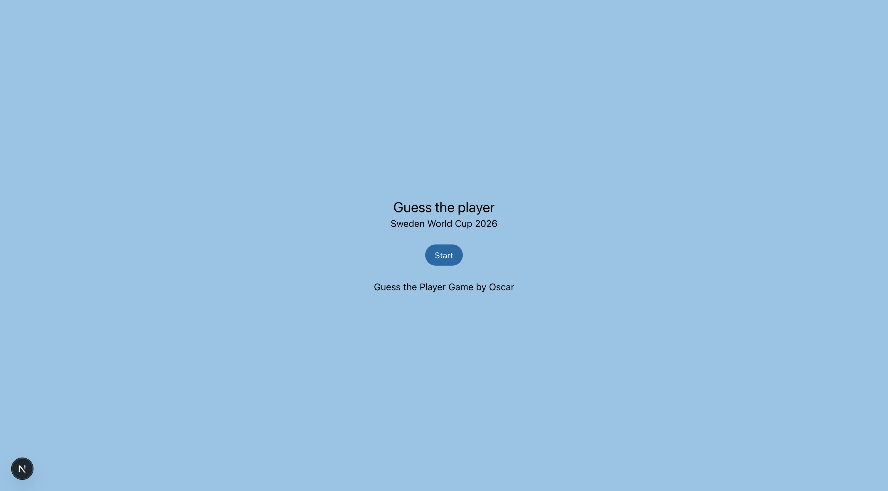
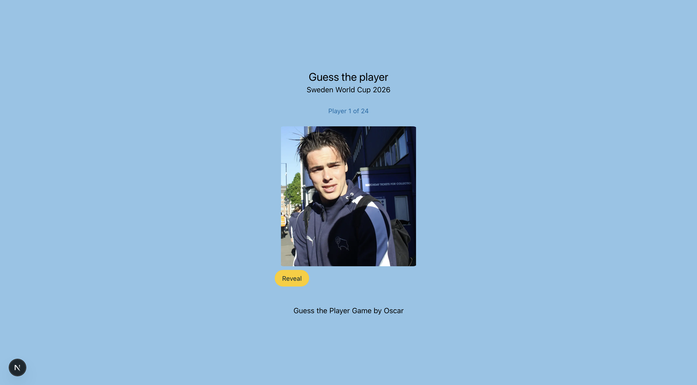
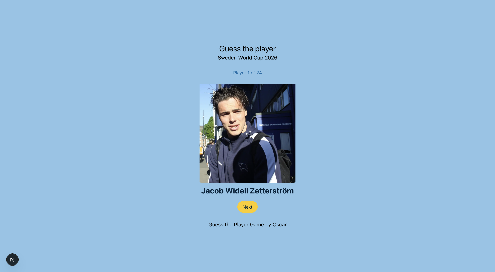
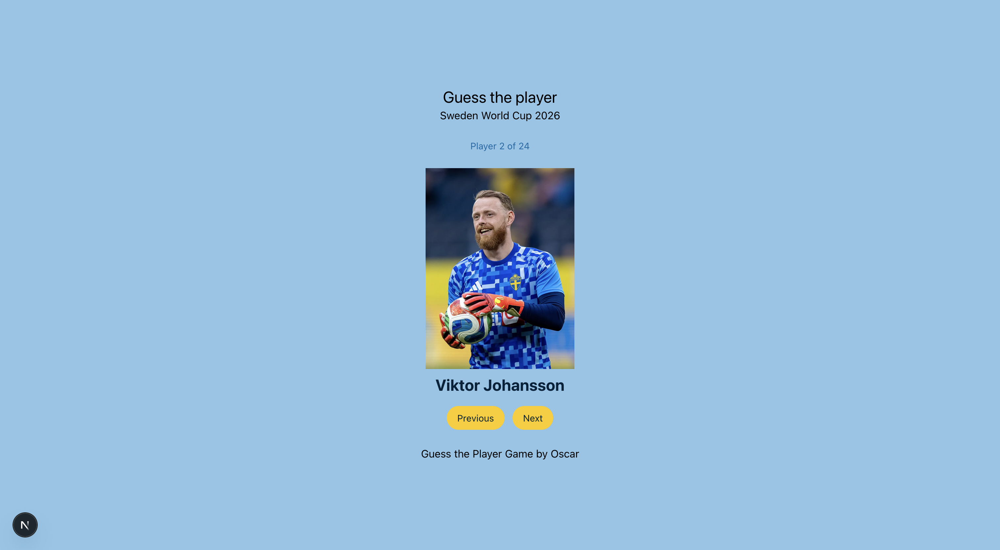

# Guess the Player Project

A flashcard quiz using Swedens World Cup 2026 squad, where you can guess each player before revealing their name. This project was built for practicing testing.

Header & Footer: Shows the main title, subtitle, and my name.
Start Screen: Shows a single "Start" button before the game begins.
Progress: Shows how far through the 24 players the user is ("Player X of 24").
Flashcard: Shows one player's photo at a time, with a "Reveal" button. Clicking Reveal shows the players name and swaps in a "Next" button. A "Previous" button appears starting from the second player.
Finished Screen: After all 24 players, shows a grid of every players photo (each linking to their Wikipedia page) along with a "Restart" button that resets the quiz back to the first player.

## Screenshots

Start screen — only the Start button is shown.

Flashcard, hidden — first players photo with the Reveal button.

Flashcard, revealed — name shown, Next button appears.

Flashcard, second player — Previous and Next both visible.

Finished screen — grid of all players with the Restart button above.
